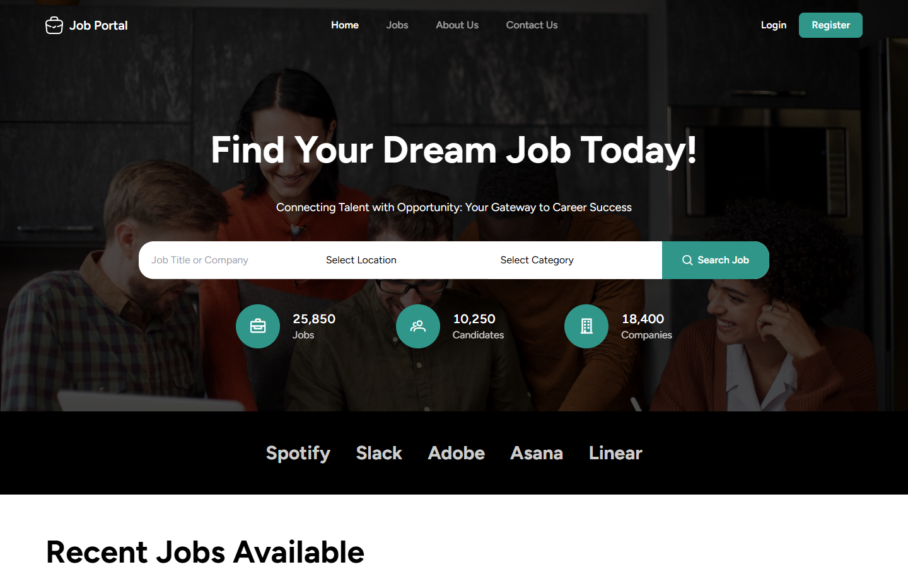
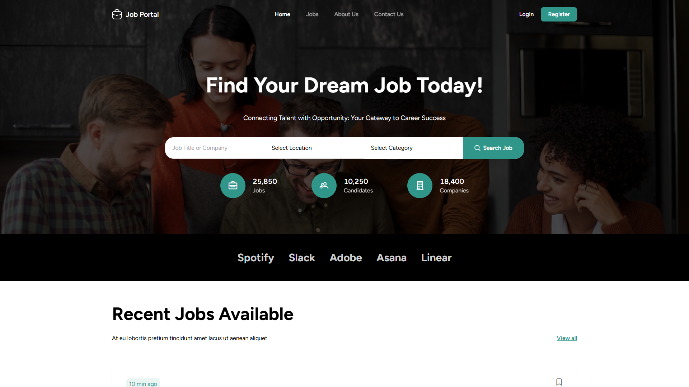
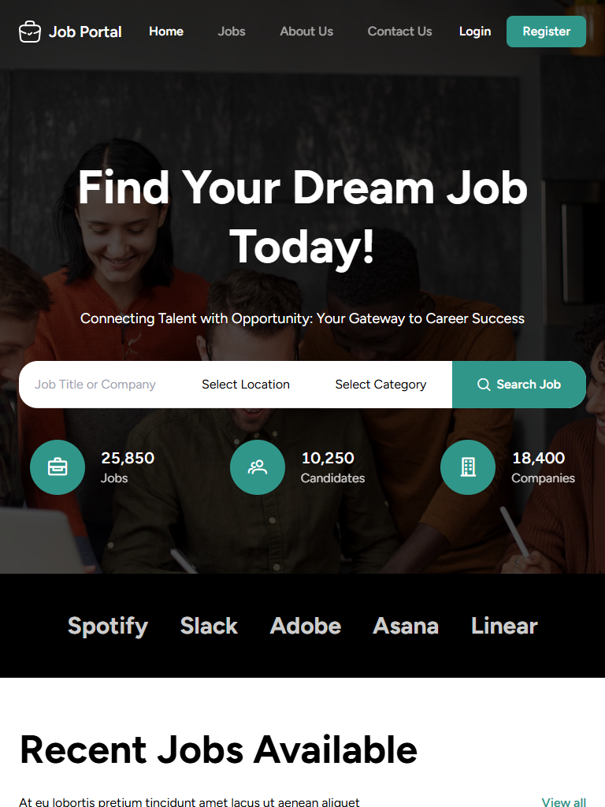
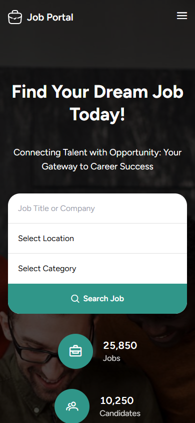
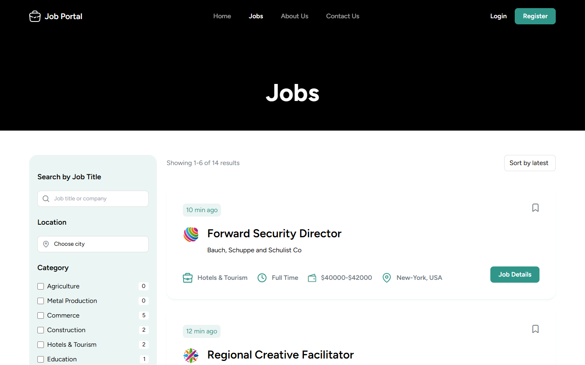
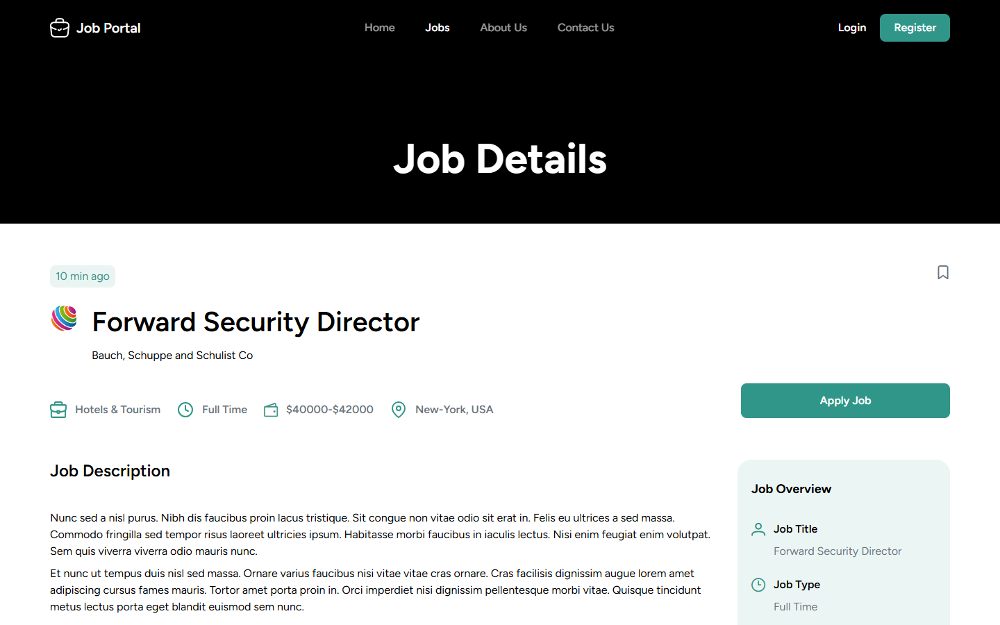

# Job Portal

A responsive job board built with **Vue 3**, **Vite** and **Tailwind CSS**, based on the [Job Portal Figma Template (Community)](https://www.figma.com/design/GttnH9dzVGaiXLCbrF1Jgd/Job-Portal-Figma-Template--Community-). Browse and filter jobs, view job details, and create an account. Every merge to `main` deploys automatically to GitHub Pages.

[](https://github.com/BranBayou/dev-jobs/actions/workflows/deploy.yml)


**Live demo:** https://branbayou.github.io/dev-jobs/



## Screenshots

The layout adapts from large desktop screens down to phones.

| Desktop · 1920×1080 | Laptop · 1440×900 |
| :---: | :---: |
|  |  |

| Tablet · 768×1024 | Mobile · 390×844 |
| :---: | :---: |
|  |  |

| Jobs listing with filters | Job details |
| :---: | :---: |
|  |  |

## Features

- **Home page:** search hero with animated statistics, recent jobs, browse by category, testimonials, and news and blog sections.
- **Jobs:** live filtering by keyword, location, category, job type, experience level, date posted, salary and tags, with sorting and pagination.
- **Job details:** job overview, responsibilities, skills, tags, related jobs and a contact form.
- **About Us and Contact Us** pages built from the Figma design, including an FAQ accordion.
- **Accounts:** register, log in (with "Remember me") and log out. Posting or editing a job requires login, and you're returned to the page you wanted afterwards.
- **Responsive** from 390px phones to 1920px desktops, with a mobile navigation menu.
- **Accessible details:** labelled form controls, the count-up animation respects `prefers-reduced-motion`, and screen readers hear final values.
- **CI/CD:** GitHub Actions builds every pull request and deploys every merge to `main`.

## Tech stack

| Area | Tools |
| --- | --- |
| Framework | [Vue 3](https://vuejs.org/) (Composition API, `<script setup>`) |
| Build | [Vite 5](https://vitejs.dev/) |
| Styling | [Tailwind CSS 3](https://tailwindcss.com/), [PrimeIcons](https://primevue.org/icons/), Figtree font |
| Routing and state | [Vue Router 4](https://router.vuejs.org/), [Pinia](https://pinia.vuejs.org/) |
| UI extras | [Vuetify 3](https://vuetifyjs.com/), [vue-toastification](https://github.com/Maronato/vue-toastification) |
| Mock API | [json-server](https://github.com/typicode/json-server) (used by the Add Job form) |
| CI/CD | GitHub Actions → GitHub Pages |

## Getting started

### Prerequisites

- [Node.js](https://nodejs.org/) 22 or newer (CI uses Node 22)
- npm (the project's lockfile is `package-lock.json`)

### Install and run

```bash
git clone https://github.com/BranBayou/dev-jobs.git
cd dev-jobs
npm install
npm run dev
```

The app runs at http://localhost:5173.

To use the **Add Job** form, also start the mock API in a second terminal. Vite proxies `/api` requests to it:

```bash
npm run server
```

### Scripts

| Command | Description |
| --- | --- |
| `npm run dev` | Start the Vite dev server with hot reload |
| `npm run build` | Build for production into `dist/` |
| `npm run preview` | Serve the production build locally |
| `npm run server` | Start json-server on port 3000 using `src/jobs.json` |
| `npm run screenshots` | Re-capture the README screenshots (see [Screenshots](#updating-screenshots)) |

## Project structure

```text
src/
├── assets/            # Global CSS (Tailwind) and images exported from Figma
├── components/        # Navbar, Footer, JobCard, Hero, CountUp, shared sections
│   └── home/          # Home-page-only sections (categories, banner, testimonials…)
├── data/jobs.js       # Dummy jobs, categories, companies and helpers
├── router/            # Routes and the login guard
├── stores/auth.js     # Pinia auth store (register, login, logout)
├── views/             # One component per page
└── main.js            # App entry: Vuetify, Pinia, router, toasts
scripts/screenshots.mjs  # Headless Chrome screenshot generator
.github/workflows/       # CI/CD pipeline
```

## Data and authentication

This is a front-end demo with no production backend:

- **Jobs** come from the static array in [`src/data/jobs.js`](src/data/jobs.js). Edit it to change the listings.
- **Accounts** are stored in the browser's `localStorage`. Passwords are saved as SHA-256 hashes, not plain text, but this is **not real security**: accounts exist only in the browser where they were created. Replace the functions in [`src/stores/auth.js`](src/stores/auth.js) with API calls when you connect a backend.
- **Add Job** posts to json-server, so it works locally with `npm run server` but not on the GitHub Pages demo.

## Deployment

[`.github/workflows/deploy.yml`](.github/workflows/deploy.yml) runs on:

| Event | Build | Deploy |
| --- | :---: | :---: |
| Push or merge to `main` | ✅ | ✅ |
| Pull request into `main` | ✅ | — |
| Manual run (Actions tab) | ✅ | ✅ |

The workflow installs with `npm ci`, builds with `BASE_PATH=/<repo-name>/` so assets resolve under the Pages sub-path, and copies `index.html` to `404.html` so deep links such as `/dev-jobs/jobs/3` load the app when refreshed.

**One-time setup:** on GitHub, go to **Settings → Pages → Build and deployment → Source** and choose **GitHub Actions**.

## Updating screenshots

`npm run screenshots` drives your local Chrome through the DevTools protocol. No extra packages are needed. It saves six images to `docs/screenshots/`. It emulates each viewport exactly, including phone widths below Chrome's minimum headless window size of about 500px.

```bash
# Capture the live site (default)
npm run screenshots

# Or capture a local production build
npm run build
npm run preview -- --port 4173
npm run screenshots -- http://localhost:4173
```

Set `CHROME_PATH` if Chrome isn't installed in the default location.

## Credits

- Design: [Job Portal Figma Template (Community)](https://www.figma.com/design/GttnH9dzVGaiXLCbrF1Jgd/Job-Portal-Figma-Template--Community-) by Figma.guru
- Icons: [PrimeIcons](https://primevue.org/icons/) and icons exported from the Figma file
